# Entity Relationship Design

## 1. Modeling conventions

- UUID primary keys are used for tenant, identity, billing, project, workflow, and externally referenced records.
- High-volume append-only scan rows may use bigint primary keys for index efficiency.
- All tenant-owned aggregate roots contain `organization_id`.
- Timestamps are UTC and include `created_at` and `updated_at` unless explicitly append-only.
- Soft deletion is used only where recovery, provider synchronization, or audit requirements justify it.
- Enums are backed by stable strings or checked small integers with documented mappings.
- Secrets are encrypted; one-time tokens are stored as digests.
- Provider payloads are retained only when necessary and under an explicit retention class.
- Database constraints mirror domain invariants.

## 2. High-level ERD

```mermaid
erDiagram
  USER ||--o{ IDENTITY : owns
  USER ||--o{ SESSION : owns
  USER ||--o{ MEMBERSHIP : joins
  USER ||--o{ INVITATION : invited_user
  ORGANIZATION ||--o{ MEMBERSHIP : has
  ORGANIZATION ||--o{ INVITATION : has
  ORGANIZATION ||--o{ TEAM : has
  TEAM ||--o{ TEAM_MEMBERSHIP : has
  MEMBERSHIP ||--o{ TEAM_MEMBERSHIP : joins
  ORGANIZATION ||--o{ ROLE : defines
  ROLE ||--o{ ROLE_PERMISSION : grants
  PERMISSION ||--o{ ROLE_PERMISSION : included
  MEMBERSHIP ||--o{ ROLE_ASSIGNMENT : receives
  TEAM ||--o{ ROLE_ASSIGNMENT : receives
  ORGANIZATION ||--o{ ROLE_ASSIGNMENT : scopes
  PROJECT ||--o{ ROLE_ASSIGNMENT : scopes

  ORGANIZATION ||--o{ PROJECT : owns
  PROJECT ||--o{ PROPERTY : contains
  PROPERTY ||--o| WEBSITE_PROPERTY_CONFIG : configures
  PROPERTY ||--o| ANDROID_PROPERTY_CONFIG : configures
  PROPERTY ||--o| IOS_PROPERTY_CONFIG : configures
  PROPERTY ||--o{ DOMAIN_VERIFICATION : verifies

  PLAN ||--o{ PLAN_VERSION : versions
  PLAN_VERSION ||--o{ PLAN_ENTITLEMENT : contains
  ENTITLEMENT_DEFINITION ||--o{ PLAN_ENTITLEMENT : defines
  ORGANIZATION ||--o{ ORGANIZATION_ENTITLEMENT_OVERRIDE : receives
  ENTITLEMENT_DEFINITION ||--o{ ORGANIZATION_ENTITLEMENT_OVERRIDE : overrides
  ORGANIZATION ||--o| BILLING_CUSTOMER : maps
  BILLING_CUSTOMER ||--o{ SUBSCRIPTION : has
  PLAN_VERSION ||--o{ SUBSCRIPTION : activates
  SUBSCRIPTION ||--o{ SUBSCRIPTION_ITEM : contains
  ORGANIZATION ||--o{ USAGE_EVENT : consumes
  ORGANIZATION ||--o{ QUOTA_RESERVATION : reserves
  ORGANIZATION ||--o{ USAGE_WINDOW : aggregates
  ORGANIZATION ||--o{ BILLING_WEBHOOK_EVENT : receives

  ORGANIZATION ||--o{ INTEGRATION_CONNECTION : owns
  PROJECT ||--o{ INTEGRATION_CONNECTION : optionally_scopes
  INTEGRATION_CONNECTION ||--o{ OAUTH_CREDENTIAL : secures

  PROPERTY ||--o{ SCAN : scans
  SCAN ||--o{ SCAN_TARGET : targets
  SCAN ||--o{ CRAWL_URL : queues
  CRAWL_URL ||--o{ CRAWL_FETCH : fetches
  CRAWL_FETCH ||--o{ PAGE_SNAPSHOT : captures
  CRAWL_FETCH ||--o{ ARTIFACT : stores
  SCAN ||--o{ CRAWL_LINK : discovers
  RULE_DEFINITION ||--o{ RULE_VERSION : versions
  RULE_VERSION ||--o{ FINDING_OCCURRENCE : produces
  FINDING ||--o{ FINDING_OCCURRENCE : observed_as
  PROPERTY ||--o{ FINDING : owns
  ISSUE ||--o{ ISSUE_FINDING : groups
  FINDING ||--o{ ISSUE_FINDING : belongs
  ISSUE ||--o{ ISSUE_ASSIGNMENT : assigned
  ISSUE ||--o{ ISSUE_COMMENT : discusses
  ISSUE ||--o{ VERIFICATION_RUN : verifies

  PROJECT ||--o{ RELEASE : deploys
  RELEASE ||--o{ RELEASE_SCAN : compares
  SCAN ||--o{ RELEASE_SCAN : used_by
  RELEASE ||--o| RELEASE_GATE_RESULT : yields

  PROJECT ||--o{ REPORT_DEFINITION : defines
  REPORT_DEFINITION ||--o{ REPORT_RUN : executes
  REPORT_RUN ||--o{ REPORT_DELIVERY : delivers
  ORGANIZATION ||--o{ NOTIFICATION_ENDPOINT : owns
  ORGANIZATION ||--o{ NOTIFICATION_POLICY : defines
  ORGANIZATION ||--o{ API_KEY : issues
  ORGANIZATION ||--o{ WEBHOOK_ENDPOINT : owns
  WEBHOOK_ENDPOINT ||--o{ WEBHOOK_DELIVERY : sends
  ORGANIZATION ||--o{ AUDIT_EVENT : records
  ORGANIZATION ||--o{ OUTBOX_EVENT : emits
```

## 3. Identity and tenancy tables

### `users`

| Column | Type | Notes |
|---|---|---|
| id | uuid | PK |
| primary_email | citext | normalized display/contact email |
| display_name | string | nullable until provider supplies or user edits |
| avatar_url | text | validated external URL or attachment reference |
| locale | string | default `en` |
| time_zone | string | IANA identifier |
| accepted_terms_at | timestamptz | nullable |
| suspended_at | timestamptz | nullable |
| deleted_at | timestamptz | nullable |

Indexes: unique partial index on lower/CI `primary_email` for active users where business rules permit. Email alone is not identity authority.

### `identities`

| Column | Type | Notes |
|---|---|---|
| id | uuid | PK |
| user_id | uuid | FK |
| provider | string | `google`, `github` |
| provider_subject | string | stable provider user ID |
| email | citext | observed provider email |
| email_verified | boolean | provider assertion |
| profile | jsonb | allowlisted profile fields |
| last_authenticated_at | timestamptz | |
| revoked_at | timestamptz | |

Unique: `(provider, provider_subject)`. Avoid automatically merging accounts merely because two providers return the same email.

### `sessions`

| Column | Type | Notes |
|---|---|---|
| id | uuid | PK |
| user_id | uuid | FK |
| token_digest | binary/string | unique digest; raw token only in secure cookie |
| ip_address_digest | string | keyed digest; raw address is not retained |
| user_agent_digest | string | keyed digest; raw value is not retained |
| last_seen_at | timestamptz | |
| expires_at | timestamptz | |
| revoked_at | timestamptz | |
| revoke_reason | string | |
| rotated_from_id | uuid | nullable self-FK for rotation lineage |

### `oauth_transactions`

| Column | Type | Notes |
|---|---|---|
| id | uuid | PK |
| provider | string | |
| state_digest | string | unique |
| nonce_digest | string | for OIDC |
| pkce_verifier_digest | string | keyed integrity/reference digest |
| pkce_verifier_ciphertext | text | encrypted |
| return_to | text | validated local path only |
| expires_at | timestamptz | |
| consumed_at | timestamptz | |
| attempt_count | integer | nonnegative callback attempts |
| last_attempted_at | timestamptz | nullable until first attempt |

### `organizations`

| Column | Type | Notes |
|---|---|---|
| id | uuid | PK |
| name | string | |
| slug | citext | canonical |
| status | string | active, suspended, pending_deletion, deleted |
| default_locale | string | |
| time_zone | string | |
| data_region | string | future-compatible |
| current_ownership_id | uuid | deferred FK to the current ownership assignment |
| suspended_at | timestamptz | required while suspended |
| deletion_requested_at | timestamptz | required once deletion is pending |
| deleted_at | timestamptz | |
| lock_version | integer | optimistic lifecycle locking |

Unique active slug index. Every organization points to one current ownership assignment;
the deferred foreign key allows the organization, initial membership and ownership row to
be created atomically without an ownerless committed state. Historical slug aliases may
live in `organization_slug_aliases`.

### `organization_slug_aliases`

| Column | Type | Notes |
|---|---|---|
| id | uuid | PK |
| organization_id | uuid | FK |
| slug | citext | globally unique historical route segment |

Aliases preserve renamed local links but resolve only after authentication and active
membership verification. Reserved navigation segments are rejected for current and alias
slugs. Application create/rename operations serialize the shared current/alias namespace
with a PostgreSQL transaction advisory lock.

### `memberships`

| Column | Type | Notes |
|---|---|---|
| id | uuid | PK |
| organization_id | uuid | FK |
| user_id | uuid | FK |
| status | string | invited, active, suspended, removed |
| display_name | string | safe membership attribution snapshot; no email |
| accepted_at | timestamptz | null while invited |
| suspended_at | timestamptz | |
| removed_at | timestamptz | |
| last_accessed_at | timestamptz | |
| lock_version | integer | optimistic lifecycle locking |

Unique `(organization_id, user_id)`; lifecycle operations reactivate the durable
membership row rather than creating ambiguous duplicate history. Removed rows are
retained for attribution and are not silently reactivated. The current ownership
membership cannot leave the active state through membership lifecycle operations.

### `organization_ownerships`

Ownership is a dedicated, durable assignment rather than an ordinary RBAC grant.

| Column | Type | Notes |
|---|---|---|
| id | uuid | PK |
| organization_id | uuid | FK |
| membership_id | uuid | same-organization composite FK |
| assigned_at | timestamptz | |
| ended_at | timestamptz | null only for the active owner |

Unique active ownership per organization. `organizations.current_ownership_id` references
the current assignment, and ownership transfer remains a dedicated domain operation.

### `invitations`

| Column | Type | Notes |
|---|---|---|
| id | uuid | PK |
| organization_id | uuid | FK |
| invited_by_membership_id | uuid | FK |
| email | citext | |
| token_digest | string | unique |
| expires_at | timestamptz | |
| accepted_at | timestamptz | |
| revoked_at | timestamptz | |
| initial_access_spec | jsonb | validated role/scope request |

### `teams`

| Column | Type | Notes |
|---|---|---|
| id | uuid | PK |
| organization_id | uuid | FK |
| name | citext | unique among active teams in the organization |
| status | string | active, archived |
| archived_at | timestamptz | required when archived |
| lock_version | integer | optimistic lifecycle locking |

### `team_memberships`

| Column | Type | Notes |
|---|---|---|
| id | uuid | PK |
| organization_id | uuid | denormalized tenant boundary |
| team_id | uuid | same-organization composite FK |
| membership_id | uuid | same-organization composite FK |
| added_by_membership_id | uuid | same-organization composite FK |
| added_at | timestamptz | |
| removed_at | timestamptz | nullable historical removal |

Unique active `(team_id, membership_id)`. Archived teams and inactive organization
members contribute no authorization principals. Rows remain for history; reactivated
members regain an otherwise-active team association.

## 4. Authorization tables

### `permissions`

Global registry.

| Column | Type |
|---|---|
| id | uuid |
| key | string |
| category | string |
| description | text |
| risk_level | string |
| active | boolean |

Unique `key`.

### `roles`

System templates may have `organization_id = null`; organization custom roles have an organization ID.

| Column | Type |
|---|---|
| id | uuid |
| organization_id | uuid nullable |
| key | string |
| name | string |
| system | boolean |
| mutable | boolean |
| archived_at | timestamptz nullable |

### `role_permissions`

Unique `(role_id, permission_id)`.

### `role_assignments`

Polymorphic grantee constrained to membership or team; scope constrained to organization or project.

| Column | Type | Notes |
|---|---|---|
| id | uuid | |
| organization_id | uuid | denormalized tenant boundary |
| grantee_type | string | Membership, Team |
| grantee_id | uuid | |
| role_id | uuid | |
| scope_type | string | Organization, Project |
| scope_id | uuid | |
| granted_by_membership_id | uuid | |
| expires_at | timestamptz | optional |
| revoked_at | timestamptz | |

Unique active assignment across grantee, role, and scope.

## 5. Plans, entitlements, billing, and usage

### `plans`

Stable commercial family: free, starter, growth, agency, enterprise.

### `plan_versions`

| Column | Type | Notes |
|---|---|---|
| id | uuid | |
| plan_id | uuid | |
| version | integer | monotonically increasing per plan |
| status | string | draft, active, retired |
| currency | string | |
| monthly_price_cents | integer | display/commercial metadata |
| annual_price_cents | integer | nullable |
| provider_mapping | jsonb | variant/price IDs per environment |
| effective_at | timestamptz | |
| retired_at | timestamptz | |

Unique `(plan_id, version)`. Activated versions are immutable.

### `entitlement_definitions`

| Column | Type | Notes |
|---|---|---|
| key | string | stable unique key |
| value_type | string | boolean, integer, decimal, string, enum |
| default_value | jsonb | safe default |
| metered | boolean | |
| unit | string | |
| description | text | |

### `plan_entitlements`

Stores typed JSON value validated against definition. Unique `(plan_version_id, entitlement_definition_id)`.

### `organization_entitlement_overrides`

Includes value, reason, source, starts/ends timestamps, and creator. An emergency deny can be modeled with highest precedence and immutable audit.

### `billing_customers`

One canonical billing customer per organization/provider/environment.

### `subscriptions`

| Column | Type | Notes |
|---|---|---|
| id | uuid | |
| organization_id | uuid | |
| billing_customer_id | uuid | |
| provider | string | |
| provider_subscription_id | string | unique per provider/environment |
| plan_version_id | uuid | local effective version |
| provider_status | string | raw canonicalized provider status |
| access_state | string | full, grace, read_only, blocked |
| current_period_start | timestamptz | |
| current_period_end | timestamptz | |
| trial_ends_at | timestamptz | |
| cancel_at_period_end | boolean | |
| canceled_at | timestamptz | |
| ended_at | timestamptz | |
| provider_updated_at | timestamptz | event ordering |
| lock_version | integer | optimistic locking |

### `billing_webhook_events`

Append-only raw ingress.

| Column | Type |
|---|---|
| id | uuid |
| organization_id | uuid nullable until correlated |
| provider | string |
| provider_event_id | string nullable |
| event_fingerprint | string |
| event_name | string |
| signature_valid | boolean |
| headers_redacted | jsonb |
| payload_ciphertext or payload | jsonb/text under retention |
| received_at | timestamptz |
| processed_at | timestamptz |
| status | string |
| attempts | integer |
| error_class | string |
| error_message_redacted | text |

Unique provider event ID when present; otherwise provider + fingerprint.

### `usage_events`

Immutable signed quantities.

| Column | Type |
|---|---|
| id | uuid |
| organization_id | uuid |
| project_id | uuid nullable |
| entitlement_key | string |
| operation | string |
| quantity | decimal |
| unit | string |
| occurred_at | timestamptz |
| idempotency_key | string |
| source_type/source_id | polymorphic |
| metadata | jsonb |

Unique `(organization_id, idempotency_key)`.

### `quota_reservations`

Tracks estimated amount, finalized amount, state, expiry, and idempotency key. Reservation and consumption operations lock the relevant usage window.

### `usage_windows`

Materialized/transactional counters by organization, entitlement key, and period boundaries.

## 6. Projects and properties

### `projects`

| Column | Type |
|---|---|
| id | uuid |
| organization_id | uuid |
| name | string |
| slug | citext |
| status | string |
| description | text |
| default_environment | string |
| settings | jsonb |
| archived_at | timestamptz |
| deletion_requested_at | timestamptz |

Unique active `(organization_id, slug)`.

### `properties`

| Column | Type |
|---|---|
| id | uuid |
| organization_id | uuid |
| project_id | uuid |
| kind | string: website/android/ios |
| name | string |
| environment | string |
| status | string |
| verified_at | timestamptz |
| settings | jsonb |
| archived_at | timestamptz |

Type-specific data belongs in one-to-one configuration tables.

### `website_property_configs`

Normalized scheme, host, port, origin, allowed-host policy, seed URLs, sitemap hints, robots behavior, crawl limits, rendering defaults.

### `android_property_configs`

Package name, supplied manifest artifact reference, expected certificate fingerprints, default locale, store identifier.

### `ios_property_configs`

Bundle ID, Team ID, associated-domain declarations, default locale, App Store identifier.

### `domain_verifications`

| Column | Type |
|---|---|
| id | uuid |
| organization_id | uuid |
| property_id | uuid |
| method | string |
| challenge_digest | string |
| expected_location | text |
| state | string |
| attempted_at | timestamptz |
| verified_at | timestamptz |
| expires_at | timestamptz |
| revoked_at | timestamptz |
| evidence | jsonb |

## 7. Integration tables

### `integration_connections`

Provider, organization, optional project, status, scopes, external account identifiers, health/freshness, connected/revoked timestamps.

### `oauth_credentials`

Encrypted access token, refresh token, expiry, token type, scopes, key version, and refresh lock metadata. Tokens never appear in application logs.

## 8. Crawl and analysis tables

### `scans`

Aggregate root with organization, project, property, initiator, kind, state, policy snapshot, entitlement snapshot, quota reservation, counters, timestamps, cancellation, error classification, and lock version.

### `scan_targets`

Seeds or explicit URLs with target kind, normalized URL, source, priority, and status.

### `crawl_urls`

High-volume frontier rows.

| Column | Type |
|---|---|
| id | bigint |
| organization_id | uuid |
| scan_id | uuid |
| normalized_url_hash | binary/string |
| normalized_url | text |
| depth | integer |
| discovered_from_id | bigint nullable |
| state | string |
| priority | integer |
| attempts | integer |
| leased_by | string |
| lease_expires_at | timestamptz |
| next_attempt_at | timestamptz |
| rejection_reason | string |

Unique `(scan_id, normalized_url_hash)` with collision verification against URL.

### `crawl_fetches`

Records requested URL, final URL, approved resolved address metadata, status, headers allowlist, timing, byte count, MIME, redirect chain, outcome, error classification, and artifact references.

### `page_snapshots`

Normalized extraction: title, descriptions, robots directives, canonical, headings summary, language, content hash, text metrics, structured-data summary, rendered/static flag, viewport/device profile.

### `crawl_links`

Source fetch/page, destination normalized key, relation, anchor summary/hash, follow flags, internal/external classification, and discovery timestamp.

### `artifacts`

Metadata for object-storage content. Access is authorized through parent aggregate; object keys are opaque.

### `rule_definitions` / `rule_versions`

Stable rule key and immutable executable/input/output version metadata.

### `findings`

| Column | Type |
|---|---|
| id | uuid |
| organization_id | uuid |
| project_id | uuid |
| property_id | uuid |
| rule_definition_id | uuid |
| fingerprint | string |
| subject_type | string |
| subject_key | text |
| lifecycle_state | string |
| first_seen_at | timestamptz |
| last_seen_at | timestamptz |
| resolved_at | timestamptz |
| recurrence_count | integer |
| latest_severity | string |
| latest_confidence | decimal |
| latest_priority | decimal |

Unique `(organization_id, fingerprint)`.

### `finding_occurrences`

Append-only scan observation with rule version, evidence JSON, severity, confidence, outcome, traffic/performance context, and timestamps.

## 9. Issue workflow tables

### `issues`

Organization, project, title, status, priority, owner/creator, due date, accepted-risk expiry, suppression state, verification state, resolved/reopened timestamps, lock version.

### `issue_findings`

Many-to-many link with active/history semantics.

### `issue_assignments`

Membership or team assignment, role in issue, assigned/revoked metadata.

### `issue_comments`

Author membership, body, edited timestamp, optional system-event type. Use Action Text only if its data and sanitization tradeoffs are accepted; plain Markdown/text is adequate for MVP.

### `verification_runs`

Requested by, issue, scan/targeted rescan, expected finding state, result, evidence, started/completed timestamps.

## 10. Releases, reports, notifications, and audit

### `releases`

Organization, project, environment, source system, external ID, revision, URL, deployed timestamp, metadata.

### `release_scans`

Role (`baseline`, `candidate`, `verification`) linking release to scan.

### `release_gate_results`

Policy snapshot, input comparison ID, outcome, counts, evidence, evaluated timestamp.

### `report_definitions`, `report_runs`, `report_deliveries`

Definitions are mutable schedules/templates. Runs freeze filters, time range, data cutoff, branding, and generated artifact. Deliveries record channel, recipient reference, status, attempts, and errors.

### `notification_endpoints` and `notification_policies`

Endpoints hold encrypted channel configuration. Policies describe event filters, quiet hours, severity, and deduplication.

### `api_keys`

Prefix for lookup, secret digest, scopes, organization/project restriction, expiry, last use, revoked timestamp.

### `webhook_endpoints` / `webhook_deliveries`

Endpoint URL, encrypted signing secret, subscribed events, active state; deliveries store event ID, attempt, response metadata, next attempt, and terminal state.

### `outbox_events`

Append-only domain event envelope with aggregate, event type/version, payload, occurred/published timestamps and idempotency ID.

### `audit_events`

Append-only actor, organization, action, subject, result, redacted metadata, request/job correlation, source IP policy field, timestamp.

## 11. Critical database constraints

1. A membership user may appear only once actively in an organization.
2. An organization can never transition to ownerless active state.
3. A property and its project must share the same organization.
4. A role assignment's role, grantee, scope, and denormalized organization must agree.
5. An activated plan version cannot be mutated.
6. Usage idempotency keys are unique within an organization.
7. Active quota reservation idempotency keys are unique within an organization.
8. A scan property and project must agree.
9. A crawl URL is unique within a scan by normalized identity.
10. Finding fingerprints are unique within an organization.
11. A provider subscription ID is unique per provider and environment.
12. A webhook event cannot be projected twice.
13. An API key stores no recoverable raw secret.
14. A one-time invitation or OAuth transaction cannot be consumed twice.
15. Object artifacts cannot be accessed without an authorized parent relation.

## 12. Retention classes

| Class | Example | Default |
|---|---|---|
| operational_short | raw webhook payload, transient errors | 30–90 days |
| scan_raw | HTML, DOM, screenshot, Lighthouse JSON | plan-defined |
| scan_normalized | page snapshots, fetch metadata | plan-defined |
| finding_history | findings and occurrences | longer plan-defined period |
| security_audit | audit events, auth activity | minimum policy period |
| billing_record | invoices/subscription projections | statutory/business policy |
| user_export | generated archives | short expiry after creation |

Retention is applied by class, organization plan, legal policy, and explicit deletion workflow.
