# Entity Relationship Design

## 1. Modeling conventions

- UUID primary keys are used for tenant, identity, billing, project, workflow, and externally referenced records.
- High-volume append-only scan rows may use bigint primary keys for index efficiency.
- All tenant-owned aggregate roots contain `organization_id`.
- Timestamps are UTC and include `created_at` and `updated_at` unless explicitly append-only.
- Soft deletion is used only where recovery, provider synchronization, or audit requirements justify it.
- Enums are backed by stable strings or checked small integers with documented mappings.
- Secrets are encrypted; one-time tokens are stored as digests.
- Provider payloads are retained only when necessary and under an explicit retention class.
- Database constraints mirror domain invariants.

## 2. High-level ERD

```mermaid
erDiagram
  USER ||--o{ IDENTITY : owns
  USER ||--o{ SESSION : owns
  USER ||--o{ MEMBERSHIP : joins
  USER ||--o{ INVITATION : invited_user
  ORGANIZATION ||--o{ MEMBERSHIP : has
  ORGANIZATION ||--o{ INVITATION : has
  ORGANIZATION ||--o{ TEAM : has
  TEAM ||--o{ TEAM_MEMBERSHIP : has
  MEMBERSHIP ||--o{ TEAM_MEMBERSHIP : joins
  ORGANIZATION ||--o{ ROLE : defines
  ROLE ||--o{ ROLE_PERMISSION : grants
  PERMISSION ||--o{ ROLE_PERMISSION : included
  MEMBERSHIP ||--o{ ROLE_ASSIGNMENT : receives
  TEAM ||--o{ ROLE_ASSIGNMENT : receives
  ORGANIZATION ||--o{ ROLE_ASSIGNMENT : scopes
  PROJECT ||--o{ ROLE_ASSIGNMENT : scopes

  ORGANIZATION ||--o{ PROJECT : owns
  PROJECT ||--o{ PROPERTY : contains
  PROPERTY ||--o| WEBSITE_PROPERTY_CONFIG : configures
  PROPERTY ||--o| ANDROID_PROPERTY_CONFIG : configures
  PROPERTY ||--o| IOS_PROPERTY_CONFIG : configures
  PROPERTY ||--|{ PROPERTY_ENVIRONMENT : targets
  PROPERTY_ENVIRONMENT ||--o{ DOMAIN_VERIFICATION : verifies
  DOMAIN_VERIFICATION ||--o{ DOMAIN_VERIFICATION_ATTEMPT : records
  INTEGRATION_CONNECTION ||--o{ DOMAIN_VERIFICATION : supplies_provider_evidence

  PLAN ||--o{ PLAN_VERSION : versions
  PLAN_VERSION ||--o{ PLAN_ENTITLEMENT : contains
  ENTITLEMENT_DEFINITION ||--o{ PLAN_ENTITLEMENT : defines
  ORGANIZATION ||--o{ ORGANIZATION_ENTITLEMENT_OVERRIDE : receives
  ENTITLEMENT_DEFINITION ||--o{ ORGANIZATION_ENTITLEMENT_OVERRIDE : overrides
  ORGANIZATION ||--o| BILLING_CUSTOMER : maps
  BILLING_CUSTOMER ||--o{ SUBSCRIPTION : has
  PLAN_VERSION ||--o{ SUBSCRIPTION : activates
  SUBSCRIPTION ||--o{ SUBSCRIPTION_ITEM : contains
  USAGE_METER_DEFINITION ||--o{ USAGE_METER_RATE : prices
  USAGE_METER_DEFINITION ||--o{ USAGE_WINDOW : meters
  USAGE_WINDOW ||--o{ USAGE_EVENT : contains
  USAGE_METER_RATE ||--o{ USAGE_EVENT : weights
  ORGANIZATION ||--o{ USAGE_EVENT : consumes
  ORGANIZATION ||--o{ QUOTA_RESERVATION : reserves
  ORGANIZATION ||--o{ USAGE_WINDOW : aggregates
  ORGANIZATION ||--o{ BILLING_WEBHOOK_EVENT : receives
  ORGANIZATION ||--o{ BILLING_RECONCILIATION_RUN : reconciles
  SUBSCRIPTION ||--o{ BILLING_RECONCILIATION_RUN : checked_by
  USER ||--o{ BILLING_SUPPORT_ACCESS_GRANT : receives

  ORGANIZATION ||--o{ INTEGRATION_CONNECTION : owns
  PROJECT ||--o{ INTEGRATION_CONNECTION : optionally_scopes
  INTEGRATION_CONNECTION ||--o{ OAUTH_CREDENTIAL : secures

  PROPERTY ||--o{ SCAN : scans
  SCAN ||--o{ SCAN_TARGET : targets
  SCAN ||--o{ CRAWL_URL : queues
  CRAWL_URL ||--o{ CRAWL_FETCH : fetches
  CRAWL_FETCH ||--o{ PAGE_SNAPSHOT : captures
  CRAWL_FETCH ||--o{ ARTIFACT : stores
  SCAN ||--o{ CRAWL_LINK : discovers
  RULE_DEFINITION ||--o{ RULE_VERSION : versions
  RULE_VERSION ||--o{ FINDING_OCCURRENCE : produces
  FINDING ||--o{ FINDING_OCCURRENCE : observed_as
  PROPERTY ||--o{ FINDING : owns
  ISSUE ||--o{ ISSUE_FINDING : groups
  FINDING ||--o{ ISSUE_FINDING : belongs
  ISSUE ||--o{ ISSUE_ASSIGNMENT : assigned
  ISSUE ||--o{ ISSUE_COMMENT : discusses
  ISSUE ||--o{ VERIFICATION_RUN : verifies

  PROJECT ||--o{ RELEASE : deploys
  RELEASE ||--o{ RELEASE_SCAN : compares
  SCAN ||--o{ RELEASE_SCAN : used_by
  RELEASE ||--o| RELEASE_GATE_RESULT : yields

  PROJECT ||--o{ REPORT_DEFINITION : defines
  REPORT_DEFINITION ||--o{ REPORT_RUN : executes
  REPORT_RUN ||--o{ REPORT_DELIVERY : delivers
  ORGANIZATION ||--o{ NOTIFICATION_ENDPOINT : owns
  ORGANIZATION ||--o{ NOTIFICATION_POLICY : defines
  ORGANIZATION ||--o{ API_KEY : issues
  ORGANIZATION ||--o{ WEBHOOK_ENDPOINT : owns
  WEBHOOK_ENDPOINT ||--o{ WEBHOOK_DELIVERY : sends
  ORGANIZATION ||--o{ AUDIT_EVENT : records
  ORGANIZATION ||--o{ OUTBOX_EVENT : emits
```

## 3. Identity and tenancy tables

### `users`

| Column | Type | Notes |
|---|---|---|
| id | uuid | PK |
| primary_email | citext | normalized display/contact email |
| display_name | string | nullable until provider supplies or user edits |
| avatar_url | text | validated external URL or attachment reference |
| locale | string | default `en` |
| time_zone | string | IANA identifier |
| accepted_terms_at | timestamptz | nullable |
| suspended_at | timestamptz | nullable |
| deleted_at | timestamptz | nullable |

Indexes: unique partial index on lower/CI `primary_email` for active users where business rules permit. Email alone is not identity authority.

### `identities`

| Column | Type | Notes |
|---|---|---|
| id | uuid | PK |
| user_id | uuid | FK |
| provider | string | `google`, `github` |
| provider_subject | string | stable provider user ID |
| email | citext | observed provider email |
| email_verified | boolean | provider assertion |
| profile | jsonb | allowlisted profile fields |
| last_authenticated_at | timestamptz | |
| revoked_at | timestamptz | |

Unique: `(provider, provider_subject)`. Avoid automatically merging accounts merely because two providers return the same email.

### `sessions`

| Column | Type | Notes |
|---|---|---|
| id | uuid | PK |
| user_id | uuid | FK |
| token_digest | binary/string | unique digest; raw token only in secure cookie |
| ip_address_digest | string | keyed digest; raw address is not retained |
| user_agent_digest | string | keyed digest; raw value is not retained |
| last_seen_at | timestamptz | |
| expires_at | timestamptz | |
| revoked_at | timestamptz | |
| revoke_reason | string | |
| rotated_from_id | uuid | nullable self-FK for rotation lineage |

### `oauth_transactions`

| Column | Type | Notes |
|---|---|---|
| id | uuid | PK |
| provider | string | |
| state_digest | string | unique |
| nonce_digest | string | for OIDC |
| pkce_verifier_digest | string | keyed integrity/reference digest |
| pkce_verifier_ciphertext | text | encrypted |
| return_to | text | validated local path only |
| expires_at | timestamptz | |
| consumed_at | timestamptz | |
| attempt_count | integer | nonnegative callback attempts |
| last_attempted_at | timestamptz | nullable until first attempt |

### `organizations`

| Column | Type | Notes |
|---|---|---|
| id | uuid | PK |
| name | string | |
| slug | citext | canonical |
| status | string | active, suspended, pending_deletion, deleted |
| default_locale | string | |
| time_zone | string | |
| data_region | string | future-compatible |
| current_ownership_id | uuid | deferred FK to the current ownership assignment |
| current_ownership_active | boolean | fixed true marker for the active composite FK |
| suspended_at | timestamptz | required while suspended |
| deletion_requested_at | timestamptz | required once deletion is pending |
| deleted_at | timestamptz | |
| lock_version | integer | optimistic lifecycle locking |

Unique active slug index. Every organization points to one current ownership assignment;
the deferred foreign key allows the organization, initial membership and ownership row to
be created atomically without an ownerless committed state. Historical slug aliases may
live in `organization_slug_aliases`.

### `organization_slug_aliases`

| Column | Type | Notes |
|---|---|---|
| id | uuid | PK |
| organization_id | uuid | FK |
| slug | citext | globally unique historical route segment |

Aliases preserve renamed local links but resolve only after authentication and active
membership verification. Reserved navigation segments are rejected for current and alias
slugs. Application create/rename operations serialize the shared current/alias namespace
with a PostgreSQL transaction advisory lock.

### `memberships`

| Column | Type | Notes |
|---|---|---|
| id | uuid | PK |
| organization_id | uuid | FK |
| user_id | uuid | FK |
| status | string | invited, active, suspended, removed |
| display_name | string | safe membership attribution snapshot; no email |
| accepted_at | timestamptz | null while invited |
| suspended_at | timestamptz | |
| removed_at | timestamptz | |
| last_accessed_at | timestamptz | |
| lock_version | integer | optimistic lifecycle locking |

Unique `(organization_id, user_id)`; lifecycle operations reactivate the durable
membership row rather than creating ambiguous duplicate history. Removed rows are
retained for attribution and are not silently reactivated. The current ownership
membership cannot leave the active state through membership lifecycle operations.

### `organization_ownerships`

Ownership is a dedicated, durable assignment rather than an ordinary RBAC grant.

| Column | Type | Notes |
|---|---|---|
| id | uuid | PK |
| organization_id | uuid | FK |
| membership_id | uuid | same-organization composite FK |
| assigned_at | timestamptz | |
| ended_at | timestamptz | null only for the active owner |
| current | boolean | true exactly when `ended_at` is null; composite FK projection |
| membership_status | string | active for current ownership, null for history; composite FK projection |

Unique active ownership per organization. `organizations.current_ownership_id` references
the same-organization current assignment through a deferred composite FK. A second deferred
composite FK requires the current assignment's membership to remain active. Ownership transfer
remains a dedicated domain operation; marker columns are constrained projections rather than
independent lifecycle state.

### `invitations`

| Column | Type | Notes |
|---|---|---|
| id | uuid | PK |
| organization_id | uuid | FK |
| invited_by_membership_id | uuid | FK |
| email | citext | |
| token_digest | string | unique |
| status | string | pending, accepted, revoked, expired, superseded |
| expires_at | timestamptz | |
| accepted_at | timestamptz | |
| accepted_by_membership_id | uuid | same-organization membership FK |
| revoked_at | timestamptz | |
| expired_at | timestamptz | |
| superseded_at | timestamptz | |
| initial_role_key | string | nullable allowlisted intent for the RBAC workflow |
| initial_scope_type | string | nullable; only Organization |
| initial_scope_id | uuid | nullable; must equal organization_id |

Only the keyed digest of the random one-time token is stored. A partial unique index permits
one pending invitation per organization/email, while resend supersedes the old row and issues
a fresh token. Lifecycle CHECK constraints bind each terminal status to exactly one timestamp;
composite foreign keys prevent cross-organization inviter and acceptor substitution. The
initial access columns are a bounded organization-scoped intent until the role-assignment
workflow applies it.

### `invitation_rate_limit_buckets`

Fixed-window counters keyed by HMAC digests protect invitation issue actor, destination email,
and acceptance IP dimensions. Raw addresses and IPs are never retained; expired buckets are
deleted by the recurring invitation maintenance job.

### `teams`

| Column | Type | Notes |
|---|---|---|
| id | uuid | PK |
| organization_id | uuid | FK |
| name | citext | unique among active teams in the organization |
| status | string | active, archived |
| archived_at | timestamptz | required when archived |
| lock_version | integer | optimistic lifecycle locking |

### `team_memberships`

| Column | Type | Notes |
|---|---|---|
| id | uuid | PK |
| organization_id | uuid | denormalized tenant boundary |
| team_id | uuid | same-organization composite FK |
| membership_id | uuid | same-organization composite FK |
| added_by_membership_id | uuid | same-organization composite FK |
| added_at | timestamptz | |
| removed_at | timestamptz | nullable historical removal |

Unique active `(team_id, membership_id)`. Archived teams and inactive organization
members contribute no authorization principals. Rows remain for history; reactivated
members regain an otherwise-active team association.

## 4. Authorization tables

### `permissions`

Global registry.

| Column | Type |
|---|---|
| id | uuid |
| key | string |
| category | string |
| scope | string | organization-only or project-safe |
| description | text |
| risk_level | string |
| active | boolean |
| catalog_checksum | string | SHA-256 of the applied governed catalog |

Unique `key`.

### `roles`

System templates may have `organization_id = null`; organization custom roles have an organization ID.

| Column | Type |
|---|---|
| id | uuid |
| organization_id | uuid nullable |
| key | string |
| name | string |
| system | boolean |
| mutable | boolean |
| assignable_scopes | string[] | organization and/or project |
| catalog_checksum | string | required for system templates; null for custom roles |
| archived_at | timestamptz nullable |

System templates have no organization owner, are never mutable or archived, and use one of
the eight reserved keys. Custom roles require exactly one organization, remain mutable, and
cannot reuse a reserved system key. These ownership rules are enforced with database CHECKs.

### `role_permissions`

Unique `(role_id, permission_id)`. Grants attached to a system role are catalog-managed and
immutable through ordinary model/application operations.

### `authorization_catalog_revisions`

| Column | Type | Notes |
|---|---|---|
| id | uuid | PK |
| schema_version | integer | positive source schema revision |
| checksum | string | unique SHA-256 of the exact YAML bytes |
| source_path | string | fixed governed repository path |
| permission_count | integer | synchronized row count |
| role_count | integer | synchronized template count |
| synced_at | timestamptz | first successful application time |

Revision rows are immutable application audit evidence. Reapplying an identical checksum does
not create another row or churn catalog timestamps.

### `role_assignments`

Polymorphic grantee constrained to membership or team; scope constrained to organization, project or
property. Property assignment is a narrower project-safe grant and never grants organization permissions.

| Column | Type | Notes |
|---|---|---|
| id | uuid | |
| organization_id | uuid | denormalized tenant boundary |
| grantee_type | string | Membership, Team |
| grantee_id | uuid | |
| role_id | uuid | |
| scope_type | string | Organization, Project, Property |
| scope_id | uuid | |
| granted_by_membership_id | uuid | |
| expires_at | timestamptz | optional |
| revoked_at | timestamptz | |
| revoked_by_membership_id | uuid | required when revoked |
| effect | string | fixed to `allow`; deny assignments are rejected |

Unique active assignment across grantee, role, and scope.

### `authorization_scope_references`

Minimal authorization projection used before and after the owning Project/Property aggregates are
introduced. Organization references use the organization UUID; project references carry their tenant;
property references additionally carry a same-organization project UUID. The table stores only scope
type and active/archive lifecycle, and composite foreign keys make assignment and property-parent tenant
agreement a database invariant. Project and Property domain operations register projection changes
through the Authorization public boundary.

## 5. Plans, entitlements, billing, and usage

### `plans`

Stable commercial family: free, starter, growth, agency, enterprise.

### `plan_versions`

| Column | Type | Notes |
|---|---|---|
| id | uuid | |
| plan_id | uuid | |
| version | integer | monotonically increasing per plan |
| status | string | draft, published, retired, grandfathered |
| display_name | string | historical presentation snapshot |
| positioning | string | historical presentation snapshot |
| currency | string | |
| monthly_price_cents | integer | display/commercial metadata |
| annual_price_cents | integer | nullable |
| pricing_kind | string | fixed or custom |
| entitlements_snapshot | jsonb | validated governed-catalog snapshot |
| catalog_checksum | string | SHA-256 of the plan definition |
| effective_at | timestamptz | |
| published_at | timestamptz | |
| retired_at | timestamptz | |

Unique `(plan_id, version)`. Non-draft versions are immutable at both the model and PostgreSQL trigger
boundaries. A stable plan is never deleted, a non-draft version is never deleted, and an audited draft cannot
be deleted. Provider price/variant identifiers belong to environment-scoped Billing mappings, not this
provider-neutral Plans record.

### `plan_version_snapshot_references`

Append-only deletion-protection registry used until and after owning invoice/report aggregates exist.

| Column | Type | Notes |
|---|---|---|
| id | uuid | PK |
| plan_version_id | uuid | restrictive FK to immutable plan version |
| reference_type | string | InvoiceSnapshot, ReportSnapshot |
| reference_id | uuid | owning immutable snapshot ID |
| created_at | timestamptz | registration time |

Unique `(reference_type, reference_id, plan_version_id)`. The restrictive FK prevents removal of commercial
history referenced by an invoice or report snapshot.

### `billing_plan_provider_mappings`

| Column | Type | Notes |
|---|---|---|
| id | uuid | PK |
| plan_version_id | uuid | restrictive FK to provider-neutral plan version |
| provider | string | Billing adapter key |
| environment | string | development, test, staging, production |
| currency | string | exact snapshot currency |
| billing_interval | string | monthly, annual |
| provider_variant_id | string | opaque provider mapping value |
| active | boolean | only active mappings are eligible |

Active mappings are unique per version/provider/environment/currency/interval, and provider variant IDs are
unique per provider/environment. Provider identifiers never become plan identity.

### `entitlement_definitions`

| Column | Type | Notes |
|---|---|---|
| key | string | stable unique key |
| value_type | string | boolean, integer, decimal, string, enum |
| unit | string | customer-facing unit/capability taxonomy |
| category | string | diagnostic grouping |
| minimum_value / maximum_value | decimal | required bounds for numeric types |
| allowed_values | jsonb | bounded exact enum strings |
| max_length | integer | required only for strings |
| allow_custom | boolean | permits explicit contract-required state |
| security_sensitive | boolean | requires a fail-closed default |
| system_default | jsonb | strictly typed safe default |
| customer_description | string | bounded display text |
| catalog_checksum | string | immutable governed definition revision |

### `plan_entitlements`

Stores `value_type`, `value_state` (`configured` or `custom`) and a typed JSON value validated against the
definition through application validation, composite definition/type FK and JSON-shape checks. Unique
`(plan_version_id, entitlement_definition_id)`. A trigger prevents update/delete once the parent plan version
leaves draft.

### `entitlement_subscription_contexts`

Tenant-safe projection of the Billing subscription used by the resolver and request-time access policy. It
carries organization, subscription, immutable plan version, non-negative subscription revision, canonical
status/access state and exact grace/cancellation deadlines. A deferred three-column FK proves that organization,
subscription and plan version came from the same Billing row while allowing a confirmed plan change to update
the subscription and context atomically. Only one current context exists per organization; delinquent and
expired contexts remain materialized for retention-safe reads.

### `organization_entitlement_overrides`

Includes organization, composite definition/type reference, strictly typed value, validity window, bounded
reason/source, same-organization creator, optional revocation time and same-organization revoker. Only one
unrevoked override exists per organization/definition. Rows are append-only except for the one-way attributed
revocation transition; every public mutation also creates a durable audit event.

### `billing_customers`

One immutable canonical billing customer mapping per organization/provider/environment. The provider customer
ID is also unique per provider/environment. A composite identity index supports a tenant/provider/environment
foreign key from subscriptions, preventing a customer reference from crossing tenants or test/live modes.

### `subscriptions`

| Column | Type | Notes |
|---|---|---|
| id | uuid | |
| organization_id | uuid | |
| plan_version_id | uuid | local effective version |
| plan_key_snapshot | string | historical stable key |
| plan_version_snapshot | integer | historical version number |
| plan_display_name_snapshot | string | historical display value |
| currency_snapshot | string | historical pricing currency |
| pricing_kind_snapshot | string | fixed or custom |
| price_cents_snapshot | bigint | selected interval price; null for custom |
| status | string | pending, incomplete, trialing, active, past_due, paused, canceled, expired |
| access_state | string | pending, full, grace, read_only, suspended |
| billing_interval | string | monthly, annual, custom |
| started_at | timestamptz | |
| ended_at | timestamptz | |
| billing_customer_id | uuid nullable | composite tenant/provider mapping FK |
| provider / provider_environment | string nullable | adapter and isolated runtime mode |
| provider_subscription_id | string nullable | opaque provider identity |
| provider_metadata | jsonb | bounded facts including raw provider status; never raw payload |
| current_period_starts_at / current_period_ends_at | timestamptz nullable | exact provider period |
| trial_ends_at / canceled_at | timestamptz nullable | provider lifecycle observations |
| grace_ends_at | timestamptz nullable | required only for past-due access; local policy deadline |
| access_expires_at | timestamptz nullable | required only for canceled access; provider-derived end |
| cancel_at_period_end | boolean | scheduled cancellation intent |
| provider_updated_at / last_synced_at | timestamptz nullable | ordering and freshness |
| provider_event_precedence | integer | deterministic equal-timestamp tie-break |
| provider_event_digest | string nullable | SHA-256 of last applied provider event identity |

Exactly one row with no `ended_at` exists per organization, including scheduled cancellation. Canonical status
and application access state are separate. Provider-backed rows require a complete same-tenant customer and
provider identity; provider identifiers and bounded raw status metadata remain owned by Billing.

### `billing_subscription_changes`

Tenant-bound, idempotent plan-change intent. It records immutable source/target plan versions, requester,
interval, direction, immediate/period-end policy, exact effective time and dispatch/submission/application or
failure timestamps. A partial unique index permits one pending, scheduled or submitted change per subscription.
Provider submission does not change canonical access; only a later validated provider event can update the
subscription and entitlement context. Existing usage windows and reservations retain their original plan
snapshot through independent tenant/subscription and plan-version foreign keys.

### `billing_webhook_events`

Durable, provider-neutral raw ingress. The row is intentionally not tenant-owned until the signed payload is
correlated during projection; the provider event itself is therefore the isolation boundary. The original
accepted payload is encrypted with authenticated encryption and never replaced by a duplicate delivery.

| Column | Type | Notes |
|---|---|---|
| id | uuid | |
| provider / provider_environment | string | adapter and isolated runtime mode |
| provider_event_id | string | stable provider-scoped logical event identity |
| event_type | string | bounded provider event name |
| payload_checksum | string | SHA-256 of the exact accepted body |
| payload_ciphertext | text | versioned AES-256-GCM envelope |
| request_headers | jsonb | allowlisted media type, body length and user-agent digest only |
| state | string | pending, processing, processed, retryable, dead_letter |
| attempt_count / duplicate_count / conflict_count | integer | non-negative operational counters |
| replay_count / parser_version | integer | retained operator attempts and local parser contract |
| processing_result | string nullable | applied, stale, observed, ignored |
| last_error_category | string nullable | bounded internal classification, never exception text |
| received_at / last_received_at | timestamptz | first and latest accepted deliveries |
| last_attempted_at / next_attempt_at / processed_at / failed_at | timestamptz nullable | lifecycle timestamps |
| organization_id / subscription_id | uuid nullable | tenant-safe correlation set only after projection |
| lock_version | integer | optimistic concurrency control |

Unique `(provider, provider_environment, provider_event_id)`. Database checks enforce checksum shape,
non-negative counters, terminal timestamps and bounded encrypted payload/header sizes. A delivery with the same
identity and checksum increments the duplicate counter; one with a different checksum increments the conflict
counter without replacing the original evidence.

### `billing_reconciliation_runs`

Durable scheduled/targeted comparison record with an exact organization/subscription composite foreign key,
provider/environment, source, constrained lifecycle, attempt/backoff timestamps, bounded difference fields and
an allowlisted provider snapshot. A partial unique index permits one active run per subscription. Targeted rows
require a support requester; scheduled rows prohibit one. Provider subscription identity is retained only as a
SHA-256 digest inside the bounded snapshot.

### `billing_support_access_grants`

Explicit platform-user grants for `billing_support.read` or `billing_support.manage`, independent of tenant
roles. A partial unique index prevents duplicate active grants and a check requires revocation after grant.

### `usage_meter_definitions` / `usage_meter_rates`

Definitions own stable meter key, raw/billing units, pool, numeric quota-entitlement key, window policy and
bounded customer description. Immutable rate versions own positive decimal weight and effective instant. The
six credit-rate values are validated against the plan blueprint; historical events retain the exact rate.

### `usage_events`

High-volume append-only bigint rows contain organization/source organization, window, meter/rate,
idempotency-key digest, canonical request checksum, event kind, signed raw quantity, applied weight, billed
quantity, source aggregate, optional same-organization manual actor/reason, bounded metadata and
occurred/recorded instants. Corrections reference an original in the same tenant/window/meter, use its exact
rate/source, have the opposite sign and cannot cumulatively overcompensate it. Unique
`(organization_id, idempotency_key_digest)`.

### `usage_quota_reservations` / `usage_quota_reservation_operations`

Tenant-owned UUID reservations retain the window and exact meter rate, SHA-256 idempotency/request digests,
source aggregate, requested/held/consumed/released billing quantities, expiry, terminal timestamps and the
final usage event. Admission snapshots use explicit `capped` or `unlimited` state and retain the numeric
limit, entitlement provenance/checksum/override plus subscription, immutable plan version and revision when
present. `custom` is not unlimited. Reservations cannot be deleted; only a held row can be extended or move
once to finalized, released or expired. Append-only bigint operation rows make extend, finalize, release and
expiry retries deterministic.

Every reservation mutation and usage-event insert acquires the same transaction-scoped PostgreSQL advisory
lock derived from organization, pool, billing unit and exact half-open period. Tenant/window/meter/rate and
finalization-event relationships have composite foreign keys; checks enforce quantity, snapshot and terminal
state shapes.

### `usage_windows`

Immutable non-overlapping half-open periods by organization and meter. Windows store UTC-calendar or explicit
provider-period policy, timezone name, provider-reference digest and optional subscription/plan/revision
snapshot. Used values are derived from events and reserved values from unexpired held reservations in all
compatible meter windows in the same pool and exact period.

## 6. Projects and properties

### `project_onboarding_drafts`

Temporary tenant-owned guided-setup state is bound to the exact active organization membership that started
it. Explicit columns store six-step project, website/mobile property, verification-method and bounded initial
crawl-preference input. The row preallocates project/property UUIDs and a public project release key so locked
completion and retries address the same aggregate identities.

A partial unique index permits one active draft per organization/member; the future aggregate identifiers and
release key are globally unique. A composite foreign key prevents cross-tenant actor substitution. Lifecycle,
step, enum, crawl-bound, release-key and completed-shape checks reject malformed direct writes. Completion
uses the row as an idempotency anchor but does not make it a parent of the resulting project/property rows.
Deleting or abandoning a draft never cascades into provisioned aggregates.

### `projects`

| Column | Type | Notes |
|---|---|---|
| id | uuid | PK and matching Authorization project-scope identity |
| organization_id | uuid | immutable tenant boundary |
| slug | citext | immutable normalized route key |
| name | string | trimmed display name |
| description | text | bounded customer context |
| status | string | active, archived, pending_deletion |
| default_locale | string | supported locale identifier |
| time_zone | string | supported Rails/IANA display zone |
| external_release_key | string | globally unique public integration identifier; not a secret |
| authorization_scope_type | string | fixed `Project` composite-FK marker |
| archived_at | timestamptz | required outside active state |
| deletion_requested_at | timestamptz | required only while pending deletion |
| work_cancellation_cutoff_at | timestamptz | cooperative cancellation boundary set on archive/delete request |
| deletion_workflow_id | uuid | exact workflow, required only while pending deletion |
| lock_version | integer | optimistic lifecycle locking |

Unique `(organization_id, slug)` across retained history and globally unique
`external_release_key`. A composite foreign key requires the project UUID and tenant to match a registered
Authorization project scope. A pending row has an exact composite foreign key to its same-tenant Project
deletion workflow. Stable tenant/slug/release identities are protected by a PostgreSQL trigger.
Archiving immediately marks the authorization scope unavailable and disables new scans; retained history
remains visible only through qualifying organization-scope grants. Final deletion requires the leased
aggregate stage of the exact workflow.

### `properties`

| Column | Type | Notes |
|---|---|---|
| id | uuid | PK and matching Authorization property-scope identity |
| organization_id | uuid | immutable tenant boundary |
| project_id | uuid | immutable same-tenant project parent |
| display_name | citext | unique within retained project history |
| kind | string | website, web_application, android_app, ios_app |
| status | string | active, archived or pending_deletion |
| verification_status | string | unverified, pending, verified, failed, expired or revoked |
| verified_at | timestamptz | required for verified state |
| configuration_version | integer | fixed to typed schema version 1 |
| archived_at | timestamptz | required outside active state |
| deletion_requested_at | timestamptz | required only while pending deletion |
| work_cancellation_cutoff_at | timestamptz | cooperative cancellation boundary |
| deletion_workflow_id | uuid | exact workflow, required only while pending deletion |
| lock_version | integer | optimistic lifecycle/configuration locking |

The property, project and organization are joined through composite foreign keys to both the Projects and
Authorization hierarchies. Type, parent and configuration version are immutable; a future type or schema
requires an explicit versioned migration. No security-critical core configuration is stored in JSON.

### `resource_deletion_workflows`

Durable Administration orchestration for an exact Project or Property target. It repeats organization,
project and optional property IDs, records the requesting membership, requested/hold/start/completion/cancel
times, state, current stage, retry time, sanitized error category, attempt count, optimistic lock and a
five-minute worker lease. A partial unique index permits one holding/running/retryable workflow per exact
target. Shape/state checks and exact pending-resource composite foreign keys prevent target substitution.

### `resource_deletion_stage_executions`

Exactly seven durable stage rows per workflow: cancellation, integrations, scans/findings, reports, object
artifacts, API keys/webhooks and aggregate records. Unique position/stage indexes plus a check fix their order.
Rows retain state, attempt count, timestamps, sanitized failure category and a bounded pagination cursor so
completed stages are not replayed after retry or worker loss.

### `audit_target_tombstones`

Append-only minimized replacement identity for a deleted Project, Property, PropertyEnvironment,
DomainVerification or CrawlPolicy. The row stores the same-tenant workflow UUID, resource hierarchy and
deletion time but no customer label, origin, credential, payload or object key. A composite workflow foreign
key and unique target identity support audit consistency after aggregate removal.

### `website_property_configs`

One-to-one typed configuration for website and web-application properties. Version 1 stores normalized
HTTP(S) scheme, hostname, effective port and canonical origin. Environment, IDNA and crawl-policy extensions
are introduced by their owning prompts.

### `android_property_configs`

One-to-one typed configuration with a normalized Android package name. Manifest artifacts, certificate
fingerprints, locales and store snapshots are separate versioned association/discovery records.

### `ios_property_configs`

One-to-one typed configuration with normalized bundle ID and uppercase Team ID. Associated-domain
declarations, locales and App Store snapshots remain separate versioned discovery records.

### `property_environments`

Tenant- and project-bound web-property environments own the exact origin later verification and scanning
operate against. Website and web-application properties receive a default production row in the same
transaction as property creation; Android and iOS properties do not have HTTP origin environments.

| Column | Type | Notes |
|---|---|---|
| id | uuid | stable environment identity |
| organization_id / project_id / property_id | uuid | composite same-tenant property relationship |
| property_kind / configuration_version | string / integer | typed-property FK projection |
| key | citext | immutable normalized key within retained property history |
| kind | string | production, staging, development or custom; immutable |
| display_name | citext | bounded customer-facing label |
| primary | boolean | true only for an active production row |
| status / archived_at | string / timestamptz | active or archived lifecycle |
| scheme / host / port / origin | typed columns | canonical ASCII HTTP(S) network identity |
| lock_version | integer | optimistic mutation version |

A partial unique index permits at most one active primary production row; deferred PostgreSQL constraint
triggers require exactly one when the parent is an active website-family property. Mutations lock the parent
property, so concurrent primary changes serialize. Environment origin identity is unique within the project,
and the primary environment is transactionally mirrored into `website_property_configs` for compatibility.
Origin or primary changes invalidate the property verification summary; Prompt 053 binds durable proof to
the exact environment and origin.

### `domain_verifications`

| Column | Type | Notes |
|---|---|---|
| id | uuid | stable challenge identity and token derivation input |
| organization_id / project_id / property_id / environment_id | uuid | exact composite tenant/environment binding |
| issued_by_membership_id | uuid | same-organization issuer |
| method | string | DNS TXT, HTML file, meta tag or Search Console adapter key |
| challenge_digest | string | SHA-256 digest of application-key-derived high-entropy proof value |
| expected_location / bound_origin | text | immutable exact proof target and canonical origin snapshot |
| state | string | pending, verified, failed, expired or revoked |
| attempt_count / attempted_at | integer / timestamptz | locked rate-limit and retry state |
| verified_at / failed_at / expired_at / revoked_at | timestamptz | auditable lifecycle timestamps |
| expires_at | timestamptz | pending deadline or maximum verified lifetime |
| failure_category | string | bounded category only for terminal failure |
| evidence | jsonb | bounded allowlisted status/count observations; never bodies or tokens |
| integration_connection_id / connection_revision | uuid / integer | immutable selected Search Console connection snapshot; nullable for other methods |
| provider_property_identifier / provider_property_type | text / string | exact URL-prefix or domain identifier; nullable for other methods |
| provider_permission_level / provider_checked_at | string / timestamptz | latest bounded Google-known observation |
| lock_version | integer | optimistic lifecycle locking |

At most one pending or verified challenge exists per environment. Immutable binding triggers prevent moving
a challenge to another tenant, resource, method or origin. An origin update revokes current challenges at the
database boundary and resets the primary property's summary. The exact instruction value is re-derived only
for an authorized `properties.verify` reader; PostgreSQL stores no recoverable raw proof value.

### `domain_verification_attempts`

Append-only attempt evidence carries the same tenant/project/property/environment identity, challenge ID,
monotonic sequence, verified/failed outcome, bounded failure category, allowlisted evidence and attempt time.
A composite foreign key prevents cross-tenant challenge substitution and a trigger rejects update/delete.
DNS attempts additionally constrain failure categories to the normalized resolver outcomes. Periodic recheck
uses the same monotonic sequence; a failed recheck remains attempt evidence and does not overwrite the last
successful `verified_at` observation.

## 7. Integration tables

### `integration_connections`

Prompt 056 creates the credential-free foundation with organization, same-tenant connecting membership,
Search Console provider, external account identifier, `search_console_oauth` consent digest, bounded granted
scopes, state, credential revision, consent/check/revocation timestamps and optimistic lock version. Composite
tenant keys and allowlists prevent cross-organization substitution or login-consent reuse. Prompt 091 extends
this provider-neutral record with encrypted credentials, optional resource scope and refresh/health behavior.

### `oauth_credentials`

Encrypted access token, refresh token, expiry, token type, scopes, key version, and refresh lock metadata. Tokens never appear in application logs.

## 8. Crawl and analysis tables

### `crawl_policy_sets` / `crawl_policy_versions`

Each active website-family environment may have one tenant/project/property/environment-bound policy head.
The head stores only the current monotonic version and optimistic lock value. Every change appends a version
with ordered start/sitemap URLs, bounded include/exclude path globs, URL/depth limits, query policy, fixed-base
user-agent suffix, rate/concurrency, mandatory robots compliance, rendering sample/cap and artifact retention.
Versions identify their same-organization creating membership and are immutable by PostgreSQL trigger.
Composite foreign keys prevent moving a head or version across tenant/resource boundaries.

### `crawl_policy_snapshots`

One immutable row per globally unique future scan UUID copies the complete effective configuration as bounded
JSON, its SHA-256 digest and exact source policy version. The tenant/project/property/environment identity is
repeated and protected by a composite source-version foreign key. Prompt 062 adds the scan-side relationship
when the scan aggregate is introduced; snapshot creation is already idempotent by `scan_id`.

### `scans`

Tenant/project/property/environment-bound aggregate root with scan type, initiator, immutable bounded settings
and entitlement snapshots plus their digests, engine/rule/config versions, optional same-target baseline and
future release correlation, lifecycle status/timestamps, safe aggregate failure category, optimistic lock and
batch-maintained counters. States are `requested`, `admitted`, `queued`, `running`, `cancel_requested`,
`canceled`, `completed`, `partially_completed` and `failed`. Composite foreign keys prevent target, initiator
and baseline substitution. Terminal scans retain no queued/running count and cannot be reopened.

### `scan_events`

Append-only bigint lifecycle/progress checkpoints repeat the exact scan hierarchy, monotonic per-scan sequence,
event/from/to status, optional same-tenant actor, idempotency/payload digests, complete counter snapshot, bounded
failure category and occurrence time. Workers write absolute idempotent batch checkpoints rather than one row per
URL. The aggregate remains the customer-facing business outcome; individual URL failures are explicit counters.

### `scan_targets`

Seeds or explicit URLs with target kind, normalized URL, source, priority, and status.

### `crawl_robots_snapshots`

One immutable row per scan/origin digest caches bounded robots policy provenance: exact tenant/project/property/
environment/scan identity, canonical origin and `/robots.txt` source, final redirect URL, retrieval status and
time, HTTP status, response SHA-256, parser version, redirect/error evidence, normalized groups, untrusted
sitemap candidates and warning codes. A unique `(scan_id, origin_digest)` index makes retrieval retries
idempotent, while a composite foreign key prevents cross-tenant or cross-resource scan substitution. Raw robots
response bodies are not stored in PostgreSQL. Checks cap JSON/array payloads and an immutable trigger permits
deletion only inside the authorized `scans_and_findings` lifecycle stage.

### `crawl_urls`

High-volume frontier rows.

| Column | Type |
|---|---|
| id | bigint |
| organization_id | uuid |
| scan_id | uuid |
| fetch_url | text, first normalized network request target |
| normalized_url_digest | SHA-256 hex string |
| normalization_version | integer |
| normalized_url | text |
| host_digest | SHA-256 hex string |
| depth | integer |
| discovered_from_id | bigint nullable |
| state | string |
| priority | integer |
| attempts | integer |
| maximum_attempts | integer |
| leased_by | string |
| lease_token_digest | SHA-256 hex string |
| leased_at | timestamptz |
| lease_expires_at | timestamptz |
| next_attempt_at | timestamptz |
| last_lease_token_digest | SHA-256 hex string |
| last_lease_outcome | string |
| last_failure_category | string |
| fetch_result_id | bigint nullable, linked when crawl fetches are introduced |
| http_status_code | integer nullable |
| completed_at | timestamptz nullable |

Unique `(scan_id, normalized_url_digest)` with collision verification against the stored identity URL and
normalization version. `fetch_url` remains distinct and immutable when query identity policy merges variants.
The exact scan hierarchy is repeated and protected by a composite foreign key; a self-reference permits
only a discovery parent from the same scan. Mutable lease state is database-checked, while a trigger protects URL,
tenant and first-discovery provenance. The bigint row ID is also the monotonic discovery sequence used after
priority and depth. Scan aggregate counters are updated transactionally by frontier batches so dashboard reads do
not count this high-volume table.

### `crawl_fetches`

Records requested URL, final URL, approved resolved address metadata, status, headers allowlist, timing, byte count, MIME, redirect chain, outcome, error classification, and artifact references.

### `page_snapshots`

Normalized extraction: title, descriptions, robots directives, canonical, headings summary, language, content hash, text metrics, structured-data summary, rendered/static flag, viewport/device profile.

### `crawl_links`

Source fetch/page, destination normalized key, relation, anchor summary/hash, follow flags, internal/external classification, and discovery timestamp.

### `artifacts`

Metadata for object-storage content. Access is authorized through parent aggregate; object keys are opaque.

### `rule_definitions` / `rule_versions`

Stable rule key and immutable executable/input/output version metadata.

### `findings`

| Column | Type |
|---|---|
| id | uuid |
| organization_id | uuid |
| project_id | uuid |
| property_id | uuid |
| rule_definition_id | uuid |
| fingerprint | string |
| subject_type | string |
| subject_key | text |
| lifecycle_state | string |
| first_seen_at | timestamptz |
| last_seen_at | timestamptz |
| resolved_at | timestamptz |
| recurrence_count | integer |
| latest_severity | string |
| latest_confidence | decimal |
| latest_priority | decimal |

Unique `(organization_id, fingerprint)`.

### `finding_occurrences`

Append-only scan observation with rule version, evidence JSON, severity, confidence, outcome, traffic/performance context, and timestamps.

## 9. Issue workflow tables

### `issues`

Organization, project, title, status, priority, owner/creator, due date, accepted-risk expiry, suppression state, verification state, resolved/reopened timestamps, lock version.

### `issue_findings`

Many-to-many link with active/history semantics.

### `issue_assignments`

Membership or team assignment, role in issue, assigned/revoked metadata.

### `issue_comments`

Author membership, body, edited timestamp, optional system-event type. Use Action Text only if its data and sanitization tradeoffs are accepted; plain Markdown/text is adequate for MVP.

### `verification_runs`

Requested by, issue, scan/targeted rescan, expected finding state, result, evidence, started/completed timestamps.

## 10. Releases, reports, notifications, and audit

### `releases`

Organization, project, environment, source system, external ID, revision, URL, deployed timestamp, metadata.

### `release_scans`

Role (`baseline`, `candidate`, `verification`) linking release to scan.

### `release_gate_results`

Policy snapshot, input comparison ID, outcome, counts, evidence, evaluated timestamp.

### `report_definitions`, `report_runs`, `report_deliveries`

Definitions are mutable schedules/templates. Runs freeze filters, time range, data cutoff, branding, and generated artifact. Deliveries record channel, recipient reference, status, attempts, and errors.

### `notification_endpoints` and `notification_policies`

Endpoints hold encrypted channel configuration. Policies describe event filters, quiet hours, severity, and deduplication.

### `api_keys`

Prefix for lookup, secret digest, scopes, organization/project restriction, expiry, last use, revoked timestamp.

### `webhook_endpoints` / `webhook_deliveries`

Endpoint URL, encrypted signing secret, subscribed events, active state; deliveries store event ID, attempt, response metadata, next attempt, and terminal state.

### `outbox_events`

Tenant-owned durable event envelope with aggregate, event type/version, bounded payload, occurred/published
timestamps, hashed idempotency identity and bounded attempt evidence. Publishers lock each row and no-op after
`published_at`; Billing writes lifecycle and plan-change events in the same transaction as canonical state.

### `audit_events`

Append-only actor, organization, action, target, result, redacted metadata, request/job correlation,
optional keyed source-IP/user-agent digests and timestamp. Membership actors use a same-organization
composite foreign key; account-security events use a user actor and may be organization-neutral. Normal
application writes cannot update or delete an event. The operator consistency report checks generic known
targets for orphaned and cross-tenant references.

## 11. Critical database constraints

1. A membership user may appear only once actively in an organization.
2. An organization can never transition to ownerless active state.
3. A property and its project must share the same organization.
4. A role assignment's role, grantee, scope, and denormalized organization must agree.
5. An activated plan version cannot be mutated.
6. Usage idempotency keys are unique within an organization.
7. Active quota reservation idempotency keys are unique within an organization.
8. A scan property and project must agree.
9. A crawl URL is unique within a scan by normalized identity.
10. Finding fingerprints are unique within an organization.
11. A provider subscription ID is unique per provider and environment.
12. A webhook event cannot be projected twice.
13. An API key stores no recoverable raw secret.
14. A one-time invitation or OAuth transaction cannot be consumed twice.
15. Object artifacts cannot be accessed without an authorized parent relation.
16. Every project has a same-organization Authorization project scope, and its stable routing/integration
    identity cannot be reassigned.
17. Every property and typed configuration has the same organization and project as its immutable parent and
    registered Authorization property scope.
18. Every active website or web-application property has exactly one active primary production environment;
    every environment is bound by composite foreign key to the same tenant, project and typed property.
19. Every verification challenge and attempt belongs to exactly one tenant-bound property environment;
    challenge bindings and attempt history are immutable, and origin changes revoke current proof.
20. Project/property and protected child deletion requires the exact same-tenant workflow UUID, expired hold,
    unexpired worker lease and correct persisted stage; direct SQL deletion is rejected by triggers.
21. Every deletion tombstone belongs to the same organization as its durable workflow and is append-only.

## 12. Retention classes

| Class | Example | Default |
|---|---|---|
| operational_short | raw webhook payload, transient errors | 30–90 days |
| scan_raw | HTML, DOM, screenshot, Lighthouse JSON | plan-defined |
| scan_normalized | page snapshots, fetch metadata | plan-defined |
| finding_history | findings and occurrences | longer plan-defined period |
| security_audit | audit events, auth activity | minimum policy period |
| billing_record | invoices/subscription projections and immutable usage ledger | statutory/business policy |
| user_export | generated archives | short expiry after creation |

Retention is applied by class, organization plan, legal policy, and explicit deletion workflow.
The current Project/Property deletion hold defaults to 30 days. Legal/privacy owners must review this product
policy, retained audit/billing classes, processor obligations, backup erasure expectations and jurisdictional
or contractual holds before launch; this schema does not assert a universal legal retention period.
